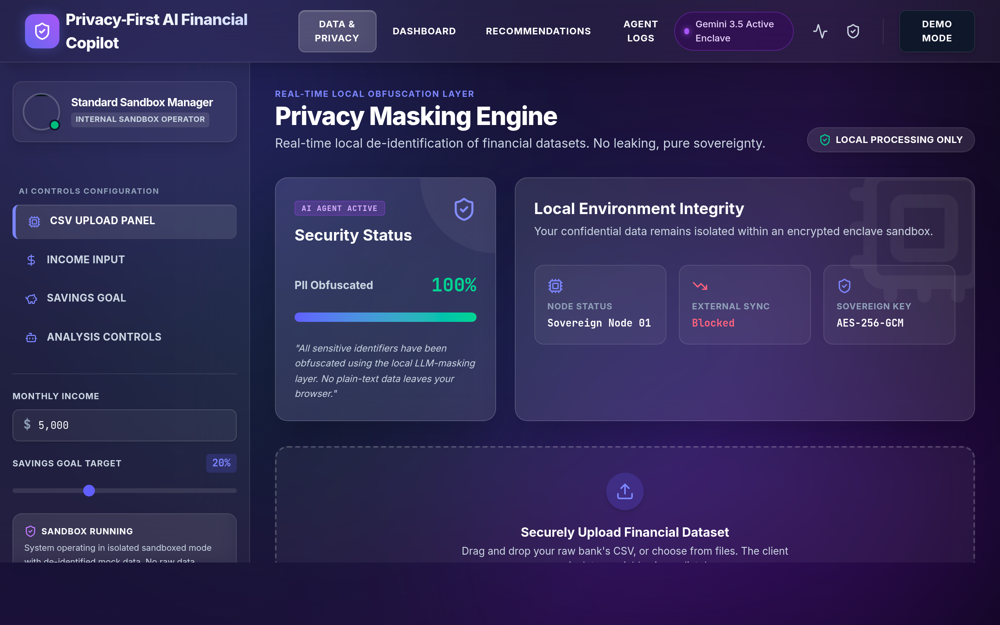

# Personal Finance Copilot 🚀

> A self-correcting, multi-agent AI financial dashboard designed to analyze spending, audit budgets, and protect user privacy in real-time.



## 🌟 Overview

**Personal Finance Copilot** is a 10/10 hackathon prototype demonstrating a next-generation enterprise AI financial platform. Unlike static dashboards, this system utilizes a dynamic, multi-agent pipeline to process real CSV data, automatically generate personalized budgets, audit its own reasoning, and provide exact financial forecasting.

## 🔥 Key Features

- **End-to-End Live CSV Pipeline:** Upload your transactions and watch the agents process them in real-time.
- **Privacy Proof Engine:** A visual masking layer that uses NER to automatically obfuscate PII (names, account numbers, etc.) before data hits the processing layer.
- **Multi-Agent Architecture:**
  - 📂 **Bookkeeper Agent:** Categorizes transactions and spots anomalies.
  - 💡 **Advisor Agent:** Proposes initial budgets and spots savings opportunities.
  - ⚖️ **Auditor Agent:** A self-correcting safety layer that stress-tests the Advisor's budget against strict financial rules.
  - 💬 **Explainability Agent:** Translates the final math into plain-English chat responses.
- **Financial Persona Classification:** Automatically tags users (e.g., *Impulse Shopper*, *Subscription Heavy*) based on spend distribution.
- **Live Forecasting:** Mathematical calculation of Monthly and Annual Savings Uplift based on personalized AI recommendations.
- **Judge Demo Mode:** A one-click automated story flow that demonstrates the entire system's self-correcting capabilities.

## 🛠 Tech Stack

This prototype is engineered for maximum performance and visual impact without relying on heavy frameworks:
- **Frontend:** Pure HTML5, CSS3, and Vanilla JavaScript.
- **Styling:** Custom CSS with dark-mode glassmorphism, glowing gradients, and native animations.
- **Architecture Mock:** Simulates a backend powered by LangGraph, FastAPI, and Pandas.

## 🚀 Getting Started

Since the entire application is completely native and dependency-free, getting started is instant:

1. Clone the repository:
   ```bash
   git clone https://github.com/Kaurvikagupta/Personal-Finance-Copilot.git
   ```
2. Navigate into the project directory:
   ```bash
   cd Personal-Finance-Copilot
   ```
3. Open `index.html` in any modern web browser! (Or use a local server like VSCode Live Server for the best experience).

## 💡 How to Demo

1. Open the app and click on **📁 Upload CSV** (or use the drag-and-drop zone).
2. The **Live Pipeline** will trigger automatically.
3. Navigate to the **Data & Privacy** tab to see the Privacy Engine obfuscate data in real-time.
4. Go to the **System Architecture** tab to see the live data flow.
5. Watch the **AI Financial Coach** generate your dynamic Persona and Forecasting metrics on the Dashboard.

*Alternatively, click the **🔥 Judge Demo Mode** button in the sidebar to run an automated, stress-tested scenario.*
